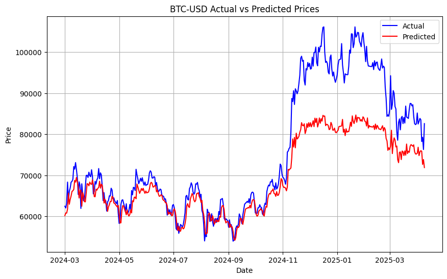

# Bitcoin Price Prediction using LSTM Neural Networks

## Overview
This project implements a deep learning model using Long Short-Term Memory (LSTM) neural networks to predict Bitcoin (BTC) prices against USD. The model analyzes historical price data to forecast future price movements, achieving an R-squared value of 0.66, indicating strong predictive performance.

## Table of Contents
- [Project Structure](#project-structure)
- [Results](#results)
- [Model Architecture](#model-architecture)
- [Predictions Visualization](#predictions-visualization)
- [Technologies Used](#technologies-used)
- [Installation & Setup](#installation--setup)
- [Usage](#usage)
- [Future Improvements](#future-improvements)

## Project Structure
The project workflow consists of the following steps:

1. **A) Installing and importing yfinance**
   - Setting up the environment with necessary libraries
   - Importing Yahoo Finance API for Bitcoin price data

2. **B) Downloading test and train data**
   - Fetching historical Bitcoin price data
   - Splitting into training and testing datasets

3. **C) Plotting data**
   - Visualizing historical Bitcoin price trends
   - Analyzing price patterns and volatility

4. **D) Normalizing train data**
   - Scaling the data for optimal neural network performance
   - Preparing data in the correct format for time series analysis

5. **E) Provide data for model**
   - Creating time series sequences for LSTM input
   - Structuring features and target variables

6. **F) Model Architecture**
   - Designing a stacked LSTM neural network
   - Implementing dropout layers to prevent overfitting

7. **G) Fitting the model into training data**
   - Training the LSTM model on historical data
   - Optimizing model parameters

8. **H) Test the model**
   - Evaluating model performance on unseen test data
   - Calculating performance metrics

9. **I) Plotting the result**
   - Visualizing predicted vs actual Bitcoin prices
   - Analyzing model accuracy and limitations

## Model Architecture
The LSTM model architecture consists of multiple stacked LSTM layers with dropout regularization:

The architecture features:
- Multiple stacked LSTM layers with 50 units each
- Dropout layers with 0.2 dropout rate to prevent overfitting
- A final Dense layer for output prediction
- Adam optimizer with Mean Squared Error loss function

## Predictions Visualization
The following chart shows the model's predictions against actual Bitcoin prices:

Key observations:
- The model accurately captures the general trend of Bitcoin prices
- It performs well during periods of steady growth or decline
- There are some limitations in predicting extreme price volatility, particularly during the late 2024 to early 2025 price surge

## Technologies Used
- **Python**: Core programming language
- **TensorFlow/Keras**: Deep learning framework for building and training LSTM models
- **yfinance**: Yahoo Finance API for retrieving Bitcoin historical data
- **NumPy/Pandas**: Data manipulation and preprocessing
- **Matplotlib/Seaborn**: Data visualization
- **scikit-learn**: Model evaluation metrics
